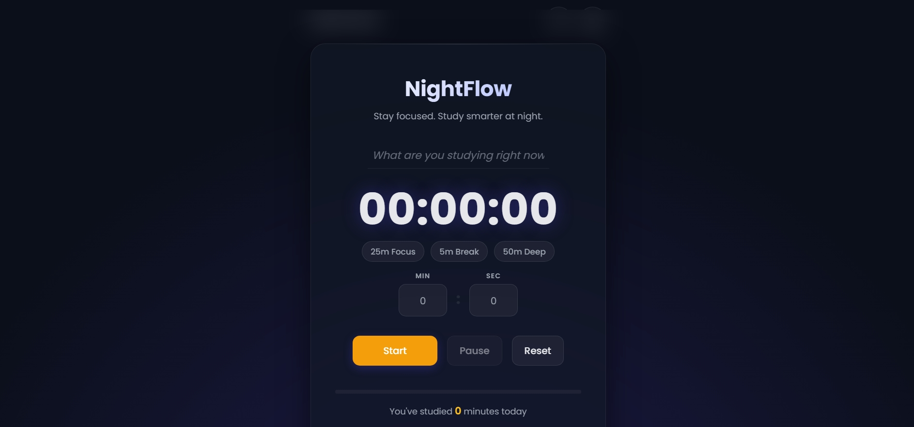

# Countdown Timer

A simple and responsive countdown timer built with HTML, CSS, and JavaScript. The application allows users to track time accurately with a clean and user-friendly interface.

---

## Live Demo

Coming Soon

---

## Screenshot

---

## Features

- Responsive design
- Countdown timer
- Clean user interface
- Easy to use
- Mobile-friendly layout

---

## Technologies Used

- HTML5
- CSS3
- JavaScript

---

## How to Run

1. Clone this repository.
2. Open the project folder.
3. Open `index.html` in your browser.

---

## Author

Isaac Zachariah

GitHub: https://github.com/isaacbuildsgood
